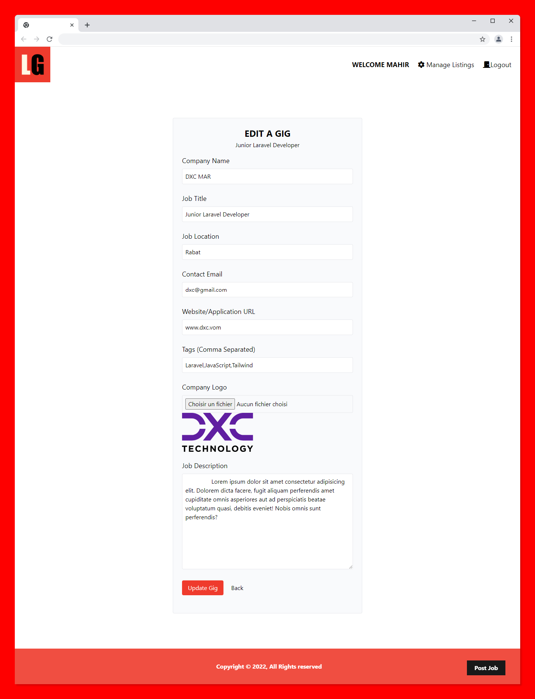

# learn-laravel-with-Laragigs-app
Learn the Laravel PHP framework from scratch by building a job listings application with Laravel 9 and MySQL.

## Table of contents

- [Overview](#overview)
  - [Screenshot](#screenshots)
  - [Links](#links)
- [My process](#my-process)
  - [Built with](#built-with)
- [Usage](#usage)
  - [Database Setup](#database-setup)
  - [Migration](#migration)
  - [Seeding The Database](#seeding-the-database)
  - [File Uploading](#file-uploading)
  - [Running The App](#running-the-app)
- [Author](#author)
## Overview

### Screenshots
some screenshots : 

### Links

- Course Source : [Laravel From Scratch](https://www.youtube.com/watch?v=MYyJ4PuL4pY)
## My process

### Built with

- Laravel 9 
- MySql
- Tailwind CSS

## usage

### Database Setup
This app uses MySQL. To use something different, open up config/Database.php and change the default driver.
To use MySQL, make sure you install it, setup a database and then add your db credentials(database, username and password) to the .env.example file and rename it to .env
### Migrations
To create all the nessesary tables and columns, run the following
'php artisan migrate'
### Seeding The Database 
To add the dummy listings with a single user, run the following
'php artisan db:seed'
### File Uploading
When uploading listing files, they go to "storage/app/public". Create a symlink with the following command to make them publicly accessible.
'php artisan storage:link'
### Running The App
Upload the files to your document root, Valet folder or run
'php artisan serve'

## Author
All rights to this project belong to Brad Traversy and the Traversy Media channel . 
- Github - [Brad Traversy](https://github.com/bradtraversy)
- Youtub channel - [Traversy Media](https://www.youtube.com/@TraversyMedia)
